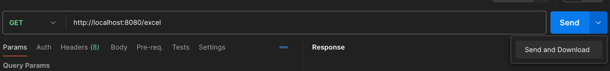

# spring-excel-extension

You can easily create an Excel file in the spring.

# What is Spring excel extension

- The "Spring Excel Extension" is an enhancement designed to facilitate easier extraction of Excel files for users of
  the Spring framework.

# Gradle
```kotlin
implementation("io.github.Yaklede:spring-excel-extension:0.0.1")
```

# How to Use

- First, prepare a DTO (Data Transfer Object) class to receive Excel data.
- Secondly, specify the names and order of the Excel columns you want to capture using the @ExcelColumn annotation.

```kotlin
data class ExcelResult(
    @ExcelColumn(name = "name", index = 0)
    val name: String,
    @ExcelColumn(name = "email", index = 1)
    val email: String,
    @ExcelColumn(name = "phone-number", index = 2)
    val phoneNumber: String,
)
```

- Next, set up a controller in Spring that can handle incoming requests.
- You should receive HttpServletResponse as a parameter in the method signature to handle parameters.

```kotlin
@RestController
@RequestMapping("/excel")
class ExcelController {
    @GetMapping
    fun getExcel(
        response: HttpServletResponse
    ): Unit {

    }
}
```

- Prepare the data to be generated as an Excel file in the form of a List.

```kotlin
val excelList = mutableListOf<ExcelResult>()

val excelResult1 = ExcelResult(
    name = "first",
    email = "first email",
    phoneNumber = "first phone number"
)

val excelResult2 = ExcelResult(
    name = "second",
    email = "second email",
    phoneNumber = "second phone number"
)

val excelResult3 = ExcelResult(
    name = "third",
    email = "third email",
    phoneNumber = "third phone number"
)

excelList.add(excelResult1)
excelList.add(excelResult2)
excelList.add(excelResult3)

```

- Call the extension function toExcelFile on the prepared List type. Receive the Excel name and HttpServletResponse as
  parameters.

```kotlin
excelList.toExcelFile(fileName = "excel-info", response = response)
```

- Now you should have received the Excel file.

## Full Example Code

```kotlin
import jakarta.servlet.http.HttpServletResponse
import kr.co.bigs.extension.excel.annotation.ExcelColumn
import kr.co.bigs.extension.excel.provider.toExcelFile
import org.springframework.web.bind.annotation.GetMapping
import org.springframework.web.bind.annotation.RequestMapping
import org.springframework.web.bind.annotation.RestController

@RestController
@RequestMapping("/excel")
class ExcelController {

    data class ExcelResult(
        @ExcelColumn(name = "name", index = 0)
        val name: String,
        @ExcelColumn(name = "email", index = 1)
        val email: String,
        @ExcelColumn(name = "phone-number", index = 2)
        val phoneNumber: String,
    )

    @GetMapping
    fun getExcel(
        response: HttpServletResponse
    ): Unit {
        val excelList = mutableListOf<ExcelResult>()

        val excelResult1 = ExcelResult(
            name = "first",
            email = "first email",
            phoneNumber = "first phone number"
        )

        val excelResult2 = ExcelResult(
            name = "second",
            email = "second email",
            phoneNumber = "second phone number"
        )

        val excelResult3 = ExcelResult(
            name = "third",
            email = "third email",
            phoneNumber = "third phone number"
        )

        excelList.add(excelResult1)
        excelList.add(excelResult2)
        excelList.add(excelResult3)

        excelList.toExcelFile(fileName = "excel-info", response = response)
    }
}
```

## You can test it using both Chrome and Postman!

### Postman



- click the Send and Download

### Chrome


- enter the URL


### Response Excel File
| No | Name   | Email        | Phone Number        |
|----|--------|--------------|---------------------|
| 1  | first  | first email  | first phone number  |
| 2  | second | second email | second phone number |
| 3  | third  | third email  | third phone number  |


